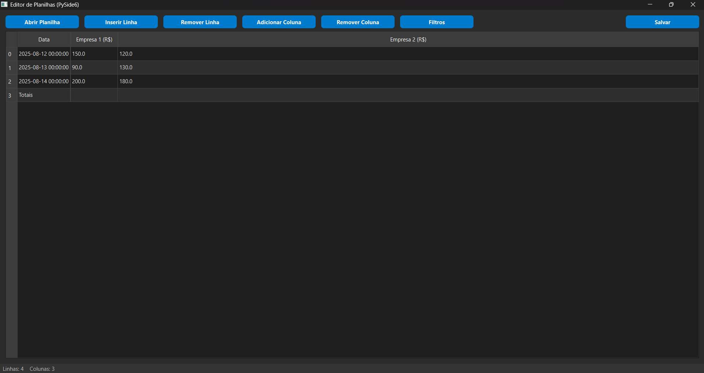

# Spreedsheet-Formatter

This project is an **interactive spreadsheet editor** built with **Python**, using **PySide6** for the graphical interface, **Pandas** for data manipulation, and **OpenPyXL** for saving/exporting to Excel format.

It allows you to open, edit, filter, add/remove rows and columns in spreadsheets, with built-in **dark mode** support.

---

## 📸 Interface (Example)

> Main editor window (Dark Mode enabled) displaying a spreadsheet with action buttons.

  

---

## 📜 Dependencies
- [Python 3.9+](https://www.python.org/)
- [PySide6](https://pypi.org/project/PySide6/)
- [Pandas](https://pandas.pydata.org/)
- [OpenPyXL](https://openpyxl.readthedocs.io/)

---

## 🛠️ Installation

Clone the repository and install the dependencies:

1. Clone this repository
```bash
git clone https://github.com/your-username/spreadsheet-editor.git
```
2. Install the packages:
````bash
  pip install -r requiriments
```` 
---

## ▶️ How to run the code

1. Open the folder: ``spreadsheet_app``
2. Run in the terminal
```bash
  python index.py
```

---

## 🏗️ Code Structure (Summary)

- **`PandasModel`**  
  Custom `QAbstractTableModel` that links a **Pandas DataFrame** to the `QTableView`.  
  Handles data display, editing, and synchronization with the DataFrame.

- **Dialogs**  
  Small windows for user input:  
  - `filter_dialog.py` → set column filters  
  - `insert_rows_dialog.py` → add a row  
  - `remove_rows_dialog.py` → remove a row  
  - `plain_text_dialog.py` → simple text input (e.g., column name)  

- **`core/spreadsheet.py` (Main Window)**  
  Main application window. Manages the UI and provides actions:  
  - Open/Save spreadsheet (`.xls`, `.xlsx`)  
  - Add/Remove rows and columns  
  - Apply filters  
  - Sort by column header  
  - Update status bar  

- **Program Entry Point (`if __name__ == "__main__":`)**  
  Creates the `QApplication`, applies the dark mode stylesheet, and runs the main window.

---

## 🎯 Future Improvements

- Multi-sheet support
- Export to .csv
- Undo/Redo functionality
- Google Sheets and Excel.Cloud integration
- Interactive visualizations with advanced animations.
